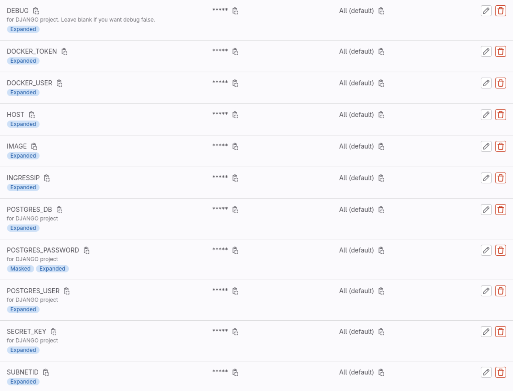
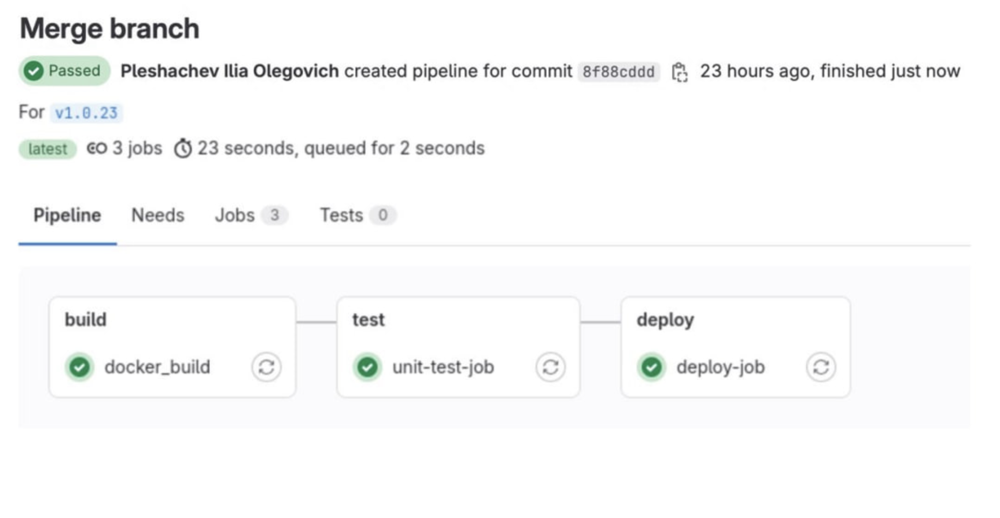
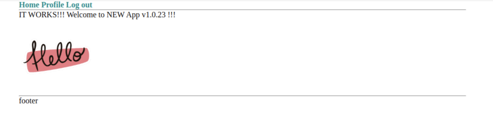

# SF DevOps Diploma - Sprint 2 - CI/CD

## Задача
```
1. Клонируем репозиторий, собираем его на сервере srv.
Исходники простого приложения можно взять [здесь](https://github.com/vinhlee95/django-pg-docker-tutorial). Это простое приложение на Django с уже написанным Dockerfile. Приложение работает с PostgreSQL, в самом репозитории уже есть реализация docker-compose — ее можно брать за референс при написании Helm-чарта.
Необходимо склонировать репозиторий выше к себе в Git и настроить пайплайн с этапом сборки образа и отправки его в любой docker registry. Для пайплайнов можно использовать GitLab, Jenkins или GitHub Actions — кому что нравится. Рекомендуем GitLab.

2. Описываем приложение в Helm-чарт.
Описываем приложение в виде конфигов в Helm-чарте. По сути, там только два контейнера — с базой и приложением, так что ничего сложного в этом нет. Стоит хранить данные в БД с помощью PVC в Kubernetes.

3. Описываем стадию деплоя в Helm.
Настраиваем деплой стадию пайплайна. Применяем Helm-чарт в наш кластер. Нужно сделать так, чтобы наше приложение разворачивалось после сборки в Kubernetes и было доступно по бесплатному домену или на IP-адресе с выбранным портом.
Для деплоя должен использоваться свежесобранный образ. По возможности нужно реализовать сборку из тегов в Git, где тег репозитория в Git будет равен тегу собираемого образа.
Чтобы создание такого тега запускало пайплайн на сборку образа c таким именем hub.docker.com/skillfactory/testapp:2.0.3.
```

## Этапы

### Регистрируем хост
1. Регистрируем доменное имя(например на reg.ru) и подключаем домен к DNS Яндекса `ns1.yandexcloud.net` и `ns2.yandexcloud.net`.
2. В Yandex-cloud создаем публичную зону с доменным именем и wildcard A-запись, указывающую на IP балансировщика (`load_balancer_public_ip`), который мы получили в 1ом спринте в п.4

---

### Создаем проект на Gitlab и регистрируем раннер
3. Переносим в репу django-приложение из задачи.
4. Добавляем новый раннер в проект: `Settings - CI/CD - Runners - New project runner` и получаем команду для его регистрации: `gitlab-runner register --url https://gitlab.com --token <токен>`.
5. Заходим на сервер **srv**: `ssh ubuntu@<external_ip_address_srv>` под sudo: `sudo su` и применяем команду выше. Executor использовать **shell**.

---

### Настраиваем Dockerhub
6. На Dockerhub создаем репо проекта с названием в формате `myusername/myprojectname`. 
7. В разделе `My account / security` и регистрируем новый токен с правами `R & W`. В дальнейшем понадобиться username и токен.

---

### Создаем приватные переменные
8. В Gitlab переходим в раздел `settings/ci_cd/variables` в репозитории 
9. Регистрируем все необходимые для проекта переменные: 
```
POSTGRES_DB: <название БД>
POSTGRES_USER: <имя пользователя БД>
POSTGRES_PASSWORD: <пароль для БД>
SECRET_KEY: <секретный ключ из настроек Django-приложения>
DEBUG: <оставить пустым, если не хотим, чтобы приложение работало в debug-режиме>
IMAGE: <название репо в dockerhub в формате myusername/myprojectname из п.6>
DOCKER_USER: <username из dockerhub из п.7>
DOCKER_TOKEN: <токен из dockerhub из п.7>
HOST: <зарегистрированное доменное имя в формате test.mysite.ru>
INGRESSIP: <ip созданного ингресс-контроллера instance_group_ingresses_public_ips>
SUBNETID: <id подсети, в которой находится ингресс-контроллер>
```
**Результат:**


---

### Создаем helm-chart
Создал директорию `./k8s/helm/`, где создал helm-chart.

Структура чарта:
```
├── k8s
│   └── helm
│       ├── values.yaml
│       ├── Chart.yaml
│       ├── templates
│       │   ├── app.yaml
│       │   ├── app-secrets.yaml
│       │   ├── _common.tpl
│       │   ├── postgres.yaml
│       │   └── postgres-secrets.yaml
```
В директории `./k8s/helm/templates` описаны манифесты:
- в `app.yaml`: описаны **deployment**, **service** и **ingress** django-приложения
- в `postgres.yaml`: описаны **deployment**, **service** и **PersistentVolumeClaim** БД
- в `app-secrets.yaml`: описаны секреты для **app**
- в `postgres-secrets.yaml`: описаны секреты для **postgres**

В файле `./k8s/helm/values.yaml` лежат настройки для **app** и **postgres**.

---

### Создаем пайплайн CI/CD

Создал файл `.gitlab-ci.yml` и описал этапы сборки и деплоя.
В пайплайне используются все созданные в п.9 переменные.

**ВНИМАНИЕ!** Джобы запускаются только из тегов

**На этапе сборки** происходит логин в наш Dockerhub, сборка образа приложения из Dockerfile(тег подставляется автоматически) и выгрузка готового образа на Dockerhub.

**На этапе деплоя** происходит запуск команды `helm upgrade --install django-release` с автоматической передачей в проект всех необходимых переменных.

---

### В ИТОГЕ
1. В итоге нужно закоммитить и запушить изменения: `git add . && git commit -m 'some six' && git push`
2. Затем проставить и запушить тег: `git tag v1.0.23 && git push origin v1.0.23`. **Только тогда запустится пайплайн.**

**Результат выполнения пайплайна в Gitlab:**


**Результат открытия приложения в браузере:**



**ВНИМАНИЕ!** Для администрирования Django-приложения через админ-панель необходимо **создать суперпользователя**. Для этого на управляющем сервере **srv** выполняем команды:
- заходим внутрь контейнера: `kubectl exec -it deployment.apps/app-deployment  -- sh`
- создаем суперпользователя: `python manage.py createsuperuser`
- вводим необходимые данные и нажимаем `Ctrl + D` для выхода
- теперь можно войти в админ-панель по адресу `http://<site>/admin`

---


